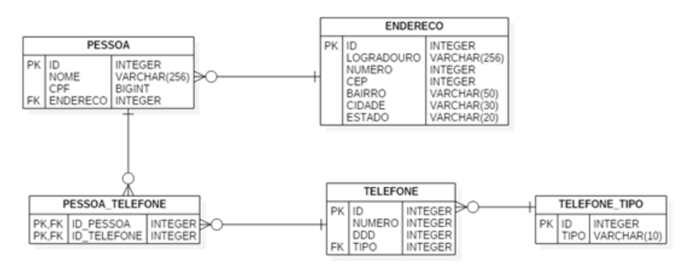
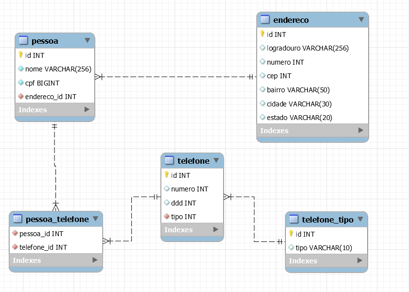
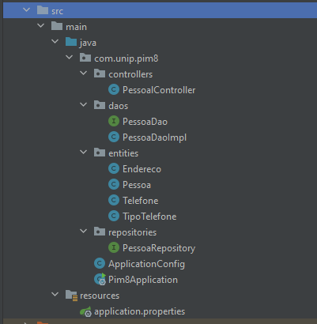

# Manual do PIM VIII  
### Curso Superior de Tecnologia em Análise e Desenvolvimento de Sistemas  
  

### Objetivos gerais

> O Projeto Integrado Multidisciplinar – PIM faz parte do Programa
> Pedagógico dos Cursos Superiores de Tecnologia a Distância da UNIP
> EaD. O PIM propicia ao aluno uma fundamentação prática dos conceitos
> teóricos adquiridos, favorecendo o diálogo entre as disciplinas que
> integram a matriz curricular, em especial aquelas do período letivo.
> Busca-se com o PIM apresentar propostas de projetos condizentes com a
> realidade contemporânea, estimular o aluno na solução de problemas
> relacionados à área e fomentar a execução de projetos envolvendo
> múltiplas disciplinas.

### Objetivos específicos
São objetivos específicos do PIM: 
>  - Desenvolver, no aluno, a prática da realização de pesquisa    científica, elaborando um trabalho conclusivo e suas ponderações;
>   - Proporcionar condições para que o aluno desenvolva na prática os conhecimentos teóricos adquiridos, colaborando no processo de
> ensino-aprendizagem; 
>  - Proporcionar condições para que o aluno adquira conhecimentos e aplique na prática em seus trabalhos conclusivos as técnicas e as
> metodologias de produção científica; 4 Manual de Estágio 
>  - Proporcionar condições para que o aluno possa argumentar e discutir as tecnologias utilizadas.

## INFORMAÇÕES ESPECÍFICAS SOBRE O TEMA
Objetivo geral Com base no conteúdo das disciplinas: Programação Orientada a Objetos II, Desenvolvimento de Software para a Internet e Tópicos Especiais de Programação Orientada a Objetos, o aluno ou grupo do PIM deverá apresentar a codificação em C#/Java do mecanismo de acesso a um trecho de banco de dados, assim como os protótipos de interface gráfica com o usuário em ASP .Net e Android ou Reactjs.

### Contextualização do caso
> Você faz parte de uma empresa de desenvolvimento de software e sua
> equipe (grupo do PIM) recebeu a tarefa de desenvolver alguns aspectos
> de um sistema que já está em desenvolvimento. Sua equipe irá
> desenvolver os seguintes aspectos:
>  - Desenvolva o mecanismo de acesso ao banco de dados em linguagem C#/Java. Esse mecanismo será o responsável por oferecer acesso a um trecho do banco de dados por parte do resto do sistema. Sempre que um trecho do sistema precisar acessar esse 24 Manual de Estágio trecho do banco de dados, deverá fazê-lo por meio desse mecanismo desenvolvido por sua equipe;
>   - Crie um protótipo de interface gráfica com o usuário em ASP .Net que permita que o usuário interaja com os dados modelados por esse trecho do banco de dados. Nota: o protótipo não precisa ser funcional;
>   - Crie um protótipo de interface gráfica com o usuário em Android que permita que o usuário interaja com os dados modelados por esse trecho do banco de dados. Nota: o protótipo não precisa ser funcional.

O modelo do trecho do banco de dados que será usado pela equipe nesse projeto está representado pelo seguinte Diagrama Entidade-Relacionamento (DER):

 - Diagrama Entidade-Relacionamento do trecho do banco de dados sob responsabilidade da equipe
	

O mecanismo de acesso ao banco de dados que sua equipe deve desenvolver deve seguir o diagrama de classes a seguir. Esse diagrama apresenta quatro entidades: Pessoa, Endereço, Telefone e TipoTelefone que mapeiam as principais tabelas do banco de dados, exceto a tabela associativa PESSOA_TELEFONE, a qual é uma tabela associativa e não é relevante para o sistema, apenas para o mecanismo de persistência do banco de dados. Mesmo assim, essa tabela deve ser manipulada pelo mecanismo de acesso.

 - Diagrama de Classes do mecanismo de acesso ao trecho do banco de dados
	

# Conclusão do PIM8  
  
### Diagrama de base de dados
Para modelar o banco de dados proposto usamos [Mysql Workbench](https://www.mysql.com/products/workbench/) para modelar os dados e também usamos o [Mysql Community server](https://dev.mysql.com/) na versão 8.0 como nossa base de dados, sua versão gratuita. Segue resultado com Mysql Workbench.

Os arquivo do Workbench para estudos está dentro da pasta `^resources/diagrama-de-dados.mwb` deste mesmo repositório Git.
### Diagrama de classes.
Para implementação das classes que estruturam o projetos usamos o [IntelliJ Community IDEA](https://www.jetbrains.com/pt-br/idea/) também usando sua versão gratuita a desenvolvedores(Existe a versão Profissional disponível por um ano à estudantes universitários).
Os codigo dos projeto foi desenvolvido usando a linguagem de programacao Java e Reactjs para fazer os prototipos para Web e Android, por ser uma [linguagem com maiores oportunidades no mercado](https://www.jetbrains.com/pt-br/lp/devecosystem-2020/?gclid=Cj0KCQiA-rj9BRCAARIsANB_4ADGLGTbxM8Goc2WhH5F9i3qTnZPW7Ouy32EN3D4bK0Zh2Tn5H9xvk0aAoopEALw_wcB&gclsrc=aw.ds) e mais fácil aprendizagem por nosso grupo pim8.
Segue nossa estrutura de organização de pastas e diagrama de classe criado no **IntelliJ Community IDEA**

Estrutura de pastas criada pelo grupo 

  

Diagrama de classe criada pelo grupo 

Para nossa implementação estudamos alguns tutoriais voltado para Java com Spring Boot, segue referencias.
 - https://blog.usejournal.com/create-a-rest-api-in-spring-boot-with-mysql-b250ff3aaa9b
 - https://www.baeldung.com/java-connect-mysql
 - http://zetcode.com/springboot/mysql/

## Protótipos de telas
